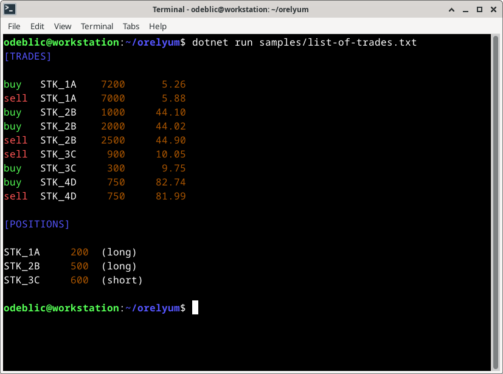
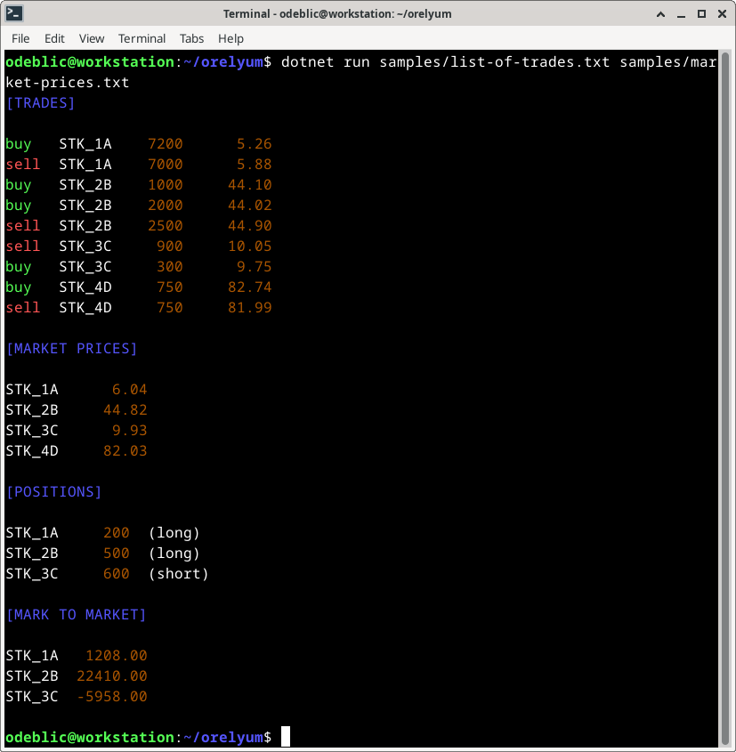

# The Orelyum Project

Because naming matters, because it is cool, because we have fun coding.


## Requirements

A list of trades previously booked is available.

| direction | symbol | quantity | price |
| --------- | ------ | -------- | ----- |
| buy       | ETF-99 |     1500 | 12.78 |
| sell      | ETF-99 |     1200 | 13.04 |
| buy       | STK-71 |      700 | 55.38 |
| sell      | STK-71 |      300 | 55.32 |

Calculate the position for each asset.

Market prices are provided for the traded products.

| symbol | price |
| ------ | ----- |
| ETF-99 | 13.15 |
| STK-71 | 55.16 |

Calculate the mark to market for each position.

## Usage

How to clone and build:

```sh
git clone https://github.com/odeblic/orelyum.git
cd orelyum
dotnet build
```

How to test and run:

```sh
dotnet run samples/list-of-trades.txt
dotnet run samples/list-of-trades.txt samples/market-prices.txt
```

## Screenshots

Positions only:



Positions and mark to market:



## License

All the content of this repository is under MIT license.

Please check carefully the terms in the `LICENSE` file.

## Author

For any question, please contact the author: [Olivier de BLIC](mailto:odeblic@gmail.com).
